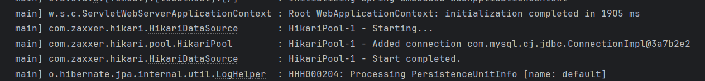

# **Spring JPA**
Para crear un proyecto utilizamos **`Spring initializr`** para generar el proyecto.

Dependencias:
- Spring Daata JPA
- Sring Web
- MySQL Driver
- Lombok 

Abrir el proyecto con IntelliJ IDEA, opcion OPEN : `Build.gradle`

Estructura de carpetas de un proyecto Spring `src/main/java/com.nameproject/`:
- Models
- Repositories
- Services
- Controllers

Configurar la conexion a la base de datos (Mysql) src/main/resources/`aplication.properties`:
```
spring.application.name=platzi-pizzeria

spring.datasource.driver-class-name = com.mysql.cj.jdbc.Driver /*indicar la base de datos*/

spring.datasource.url=jdbc:mysql://localhost:3306/pizzeria?createDatabaseIfNotExist=true  /*crea la base de datos*/

spring.datasource.username=root

spring.datasource.password=1234

/*Gestionar los schemas gracias a los DLL*/
spring.jpa.hibernate.ddl-auto=update

spring.jpa.show-sql=true /*Mostrar en consola como se traduce el codigo a sql */
```
**Gestionar schemas: spring.jpa.hibernate.dll-auto:**
- `update`: (Update schema if necesary) Cuando haya un cambio en nuestras entidades y nuestra base de datos no lo tenga. `Hibernate creara lo que Haga falta`
- `create`: (Create schema and destroy previus data) Borra todo lo que hay y vuelve a cargar todo el schema.
- `create-drop` (Create and then destroy the schema at the end session)
- `none` (Disable DDL handling) Desabilitar la gestion de base de datos , solo nos permitira manejar los datos.
- `validate` (validate the schema, make no changes to the database)




### **Entities**
@Entity + @Table : Le indica a la clase que se comportara como una entidad y sera traducida a una tabla.

```

```


