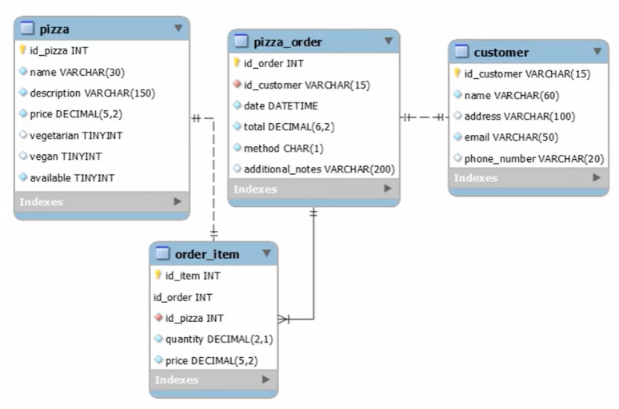

# **Spring JPA**
Para crear un proyecto utilizamos **`Spring initializr`** para generar el proyecto.

Dependencias:
- Spring Daata JPA
- Sring Web
- MySQL Driver
- Lombok 

Abrir el proyecto con IntelliJ IDEA, opcion OPEN : `Build.gradle`

Estructura de carpetas de un proyecto Spring `src/main/java/com.nameproject/`:
- Models
- Repositories
- Services
- Controllers

Configurar la conexion a la base de datos (Mysql) src/main/resources/`aplication.properties`:
```
spring.application.name=platzi-pizzeria

spring.datasource.driver-class-name = com.mysql.cj.jdbc.Driver /*indicar la base de datos*/

spring.datasource.url=jdbc:mysql://localhost:3306/pizzeria?createDatabaseIfNotExist=true  /*crea la base de datos*/

spring.datasource.username=root

spring.datasource.password=1234

/*Gestionar los schemas gracias a los DLL*/
spring.jpa.hibernate.ddl-auto=update

spring.jpa.show-sql=true /*Mostrar en consola como se traduce el codigo a sql */
```
**Gestionar schemas: spring.jpa.hibernate.dll-auto:**
- `update`: (Update schema if necesary) Cuando haya un cambio en nuestras entidades y nuestra base de datos no lo tenga. `Hibernate creara lo que Haga falta`
- `create`: (Create schema and destroy previus data) Borra todo lo que hay y vuelve a cargar todo el schema.
- `create-drop` (Create and then destroy the schema at the end session)
- `none` (Disable DDL handling) Desabilitar la gestion de base de datos , solo nos permitira manejar los datos.
- `validate` (validate the schema, make no changes to the database)


### **Entities**
@Entity + @Table : Le indica a la clase que se comportara como una entidad y sera traducida a una tabla.

```
@Entity
@Table(name = "Pizza")
@Getter
@Setter
@NoArgsConstructor
public class PizzaEntity {
    @Id
    @GeneratedValue(strategy = GenerationType.IDENTITY)
    @Column(name = "id_pizza",nullable = false)
    private Integer idPizza;
}
```
### **Relaciones**

- **`@OneToOne`** : Para establercer relaciones 1 a 1.
Parametros para garantizar el principio de responsabilidad unica.(para que no se inserten o actulizen )

    - private PizzaEntity pizza -> Atributo que hace referencia a la clase  a relacionarse
    - @OneToOne -> Indicar la relación 1 a 1.
    - @JoinColumn -> A traves de que columna se establece la relación.

- **`ManyToOne`**: Para relaciones muchos a 1.
```
/*==========PizzaOrderEntity -> PizzaEntity==============*/
public class OrderItemEntity {

    @Id
    @Column(name = "id_item",nullable = false)
    private Integer idItem;

    @Id
    @Column(name = "id_order", nullable = false)
    private Integer idOrder;

    @Column(name ="id_pizza", nullable = false)
    private Integer idPizza;

    @Column(columnDefinition = "DECIMAL(5,2)", nullable = false)
    private Double price;

    @OneToOne
    @JoinColumn(name = "id_pizza", referencedColumnName = "id_pizza", insertable = false,updatable = false)
    private PizzaEntity pizza; /*Instanciando con el entity a relacionarse*/

    @ManyToOne
    @JoinColumn(name = "id_order",referencedColumnName = "id_order", insertable = false, updatable = false)
    private OrderEntity order;

}

```

Especificando la relacion entre **`OrderItemEntity`** y **`OrderEntity`**

- private List<OrderItemEntity> items;

- @OneToMany -> Un `OrderEntity` puede contener muchos `OrderItemEntity`
- mappedBy -> mapeada con el atributo `order` de OrderItemEntity

```

public class OrderEntity {
    @GeneratedValue(strategy = GenerationType.IDENTITY)
    @Id
    @Column(name = "id_order")
    private Integer idOrder;
    .
    .
    .
    @Column(nullable = false,columnDefinition = "DECIMAL(6,2)")
    private Double total;

    /*Relaciones*/
    @OneToMany(mappedBy = "order")
    private List<OrderItemEntity> items;

    @OneToOne
    @JoinColumn(name = "id_customer", referencedColumnName = "id_customer", insertable = false, updatable = false)
    private CustomerEntity customerEntity;
}

```


